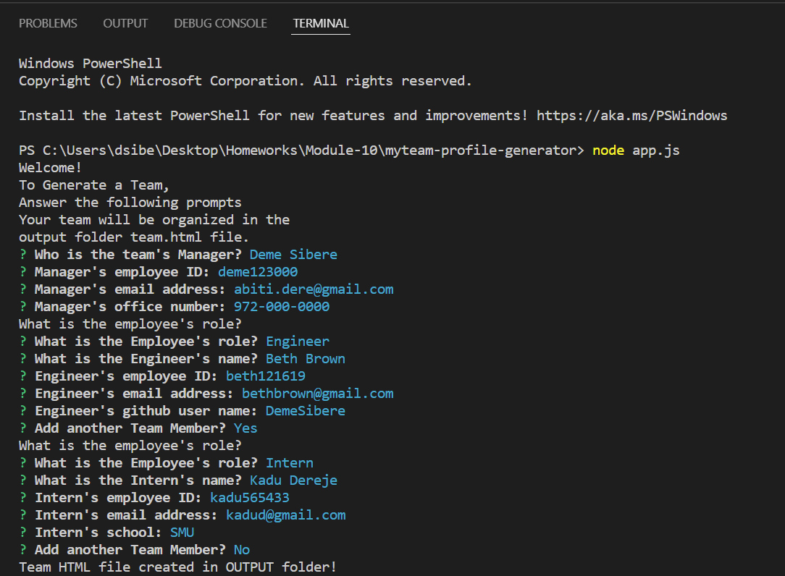
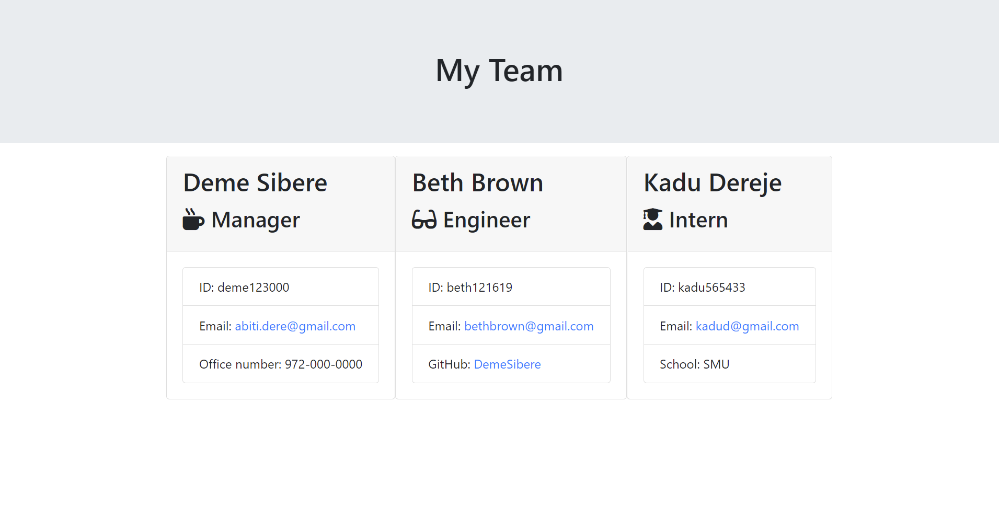
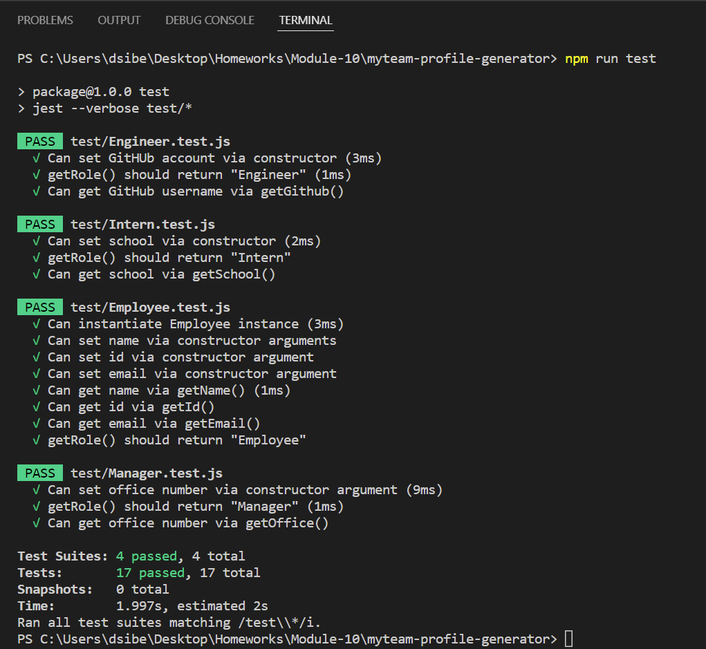

## Description

This project is assigned by Trilogy Education Sercices, LLC at Southern Methodist University. It is to build a Node.js 
command-line application that takes in information about employees on a software engineering team, then generates 
an HTML webpage that displays summaries for each person. As a result, this Node CLI application takes in information 
aboutemployees and generates an HTML webpage that displays summaries for each person.

## Table of Contents

- [User Story](#user-story)

- [Installation](#installation)

- [Usage](#usage)

- [Functionality](#functionality)

## User Story

``
As a manager:
I want to generate a webpage that displays
my team's basic info.
So that I have quick access to emails
and GitHub profiles.``

 

## Installation

To install Team Profile Generator dependencies run the following command:

``
**npm init``

To use Team Profile Generator run the following command in the terminal:
`
**node app.js**`

To test Team Profile Generator run the following command in the terminal:
`
**npm run test**`

## Usage

A user can build a team of software engineer employees with different roles 
Using the command line application. After the user completes the prompts then 
the team will be displayed in a new HTML file.

## Functionality 

* A walkthrough gif and video that demonstrates the functionality of the Team Profile Generator and passing tests
    can be found here:

    * GIF of the the team profile generator

    * Video of the Team Profile Generator and passing tests. To watch a walkthrough video, click 👉 [here](https://drive.google.com/file/d/1wBos3Mwg6sG4KbgLB88rQLLg_RmBh5GJ/view)

    * Below is the question page

    * Below is my team's profile page 

    * Below is the passing test page 

